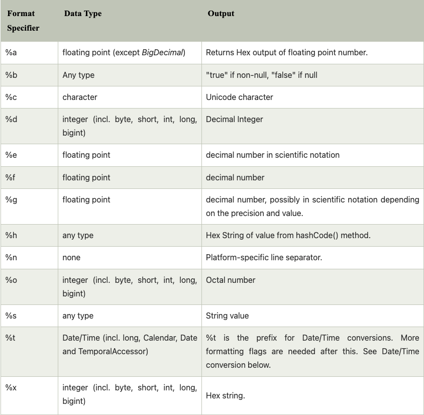

# Java-Lab-002

## Variables, Types and Operators

Be able to explain what variables are. Understand variable types, allowed names, and valid values.
Know how to create and use string, integer, floating-point, and boolean variables.

### Part 1 - PricelessScript.java - [MasterCard YouTube Ad](https://www.youtube.com/watch?v=Q_6stXKGuHo)

The lab template contains a program that prints the following:
```
2 tickets: $28.00
2 hotdogs, 2 popcorn, 2 sodas: $18.00
1 autographed baseball $45.00
real conversation with 11 year old son: priceless
true
```

Ignore the code that you don't fully recognize and concentrate on changing the variables to alter the MasterCard *Priceless* script to say:
```
3 tickets: $42.00
3 hotdogs, 3 popcorn, 3 sodas: $27.00
2 autographed baseball $90.00
watching the Giants win: priceless
false
```

### Part 2 - Interpretation
Take note of the various variables and their data types. Write a brief summary in this section of the README.md file listing the:
* Variable name
* Its data type
* and example values you can assign them.

*int people: refers to the amount of people at the ball game that you're paying for. It is an integer, so only whole numbers can be put here. You can assign any integer like 5, 6, or 67.

*float ticketPrice: is the cost of each ticket. This is a floating number which means that it is a less precise number, so it can be a number like 400.001f, .00025f, or 15.0f. However, you would need to indicate that it is a float number by putting a f at the end of the number. And it only counts 6 to 7 digits of numbers, hence it being a less precise number.

*double itemPrice: this is the price of the items. It is a double precision number, which can represent a the entirety of a >7 digit number. It can be any number like 1.2, 20.05, or the pie value in its entirety. 

*boolean trueOrFalse: This is a variable of true or false. Generally the only values you can assign this is true or false. However some programming languages can be 1 or 0, and java is not one of those languages.


Next give TWO example variable names and TWO example variable assignments that are *WRONG* and explain why.
* Hint: your IDE can help you discover these!

Two examples of wrong variable names are

*int Parties! = 50

*int Number of Dogs I Have = 6

These names are incorrect because they have ! and spaces. Java naming conventions restrict what names can be made up of.

Two exampes of wrong variable assignments are:

boolean peopleITolerate = 3

float bigNumber = 3.3333

The boolean assignment should only be true or false, int would be the only variable assignment for 3. The float number is missing the f indicator, double would be the best fit for this number.

### Part 3 - Bonus: Play around with Java String Format Specifiers.

Pick several of the Java format specifiers below and define variables of the correct type utilize *sout* and *String.format* to view the resulting formats.




### Part 4 - Submission
* Just as you did last week (Reference the Lab video in your Week 1 module), create a Spring2023 feature branch of your code
* Commit your working code to your local copy
* Push it to your Remote/origin branch (i.e. GitHub: Spring2023 -> origin/Spring2023)
* Then issue a Pull request to my instructor branch
    * Make sure to save the Pull request URL and submit it for the lab.
